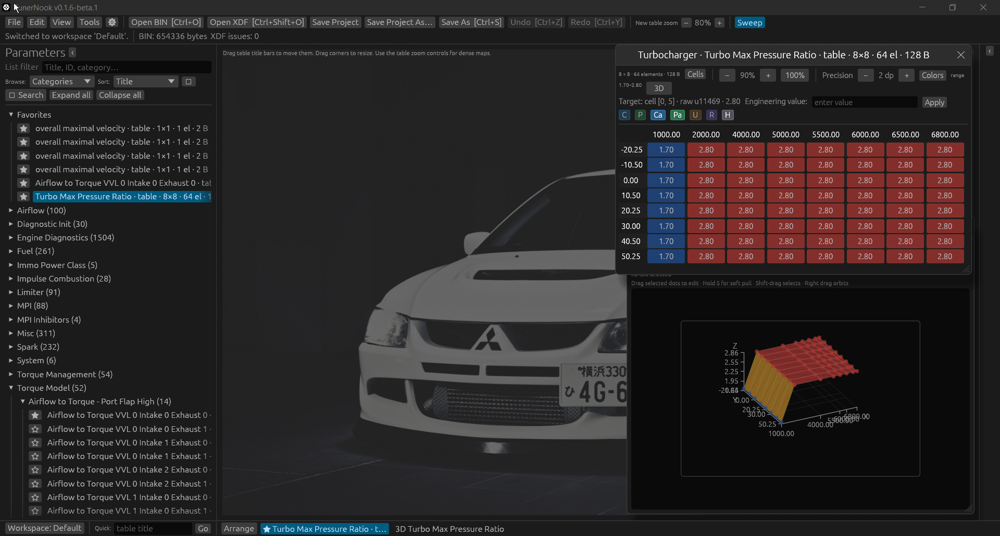
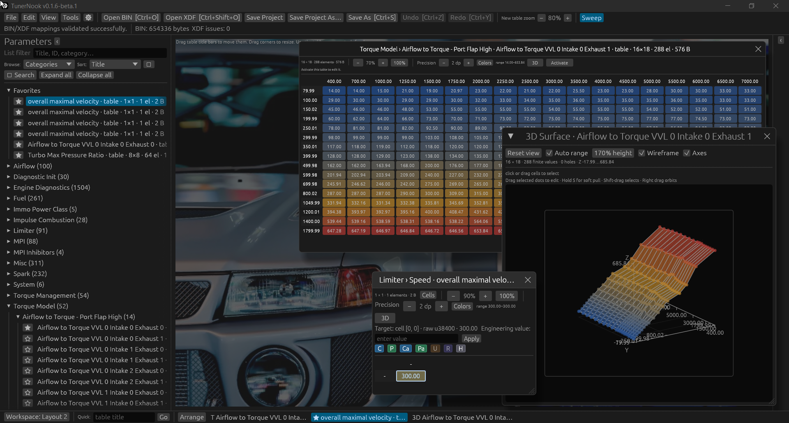

# TunerNook

**A personal BIN/XDF calibration editor, built for my own workflow and shared so others can help improve it.**

I made TunerNook for myself: I wanted a Windows-first calibration workspace
that remembers where I left off and makes it easier to inspect, compare, and
carefully edit maps. I decided to share it because I hope other people can use
it, improve it, and share it too. The code is MIT-licensed; calibration data is
not included. The current release is an early beta, and thoughtful feedback is
welcome.

## Beta and safety notice

TunerNook is experimental ECU calibration software. A defect, incorrect XDF,
misidentified map, mistaken edit, or agent suggestion could corrupt data or
damage an engine or vehicle. Keep untouched backups, independently verify every
definition and change, and do not treat test results or AI output as a safety
check. Do not flash or use a calibration unless you understand and have
validated it.

The software is provided “AS IS”, without warranty, under the MIT License. To
the fullest extent allowed by law, I accept no responsibility for defects,
data loss, vehicle or equipment damage, or other loss arising from using
TunerNook or third-party agent output. You are responsible for deciding whether
and how to use it.

## Yes, it's vibe-coded

TunerNook is vibe-coded. I used AI-assisted development, and I want to be
straight about that. I also run tests regularly rather than asking people to
trust the app on my word alone. For Beta 1, the workspace suite reported **531
passed and 8 fixture-dependent tests skipped**, and the Windows release smoke
test passed **21/21**. Those checks catch regressions; they do not prove the
software is defect-free, correct for every ROM, or safe for a vehicle.

## What makes TunerNook different

These are the priorities I built around for my own work—not a claim that
TunerNook replaces mature tools or is better at every job.

- **Return to your workspace:** named layouts can remember which windows were
  open, minimized, or focused, along with their positions, sizes, zoom, and
  scroll state.
- **See both the number and its storage:** inspect engineering values alongside
  raw values, axes, conversions, and bytes in the Hex Editor.
- **Explore unknown maps without pretending guesses are facts:** Map Finder
  scores candidate grids and may suggest axes, but candidates and axes are
  explicitly unverified until you check them.
- **Move between views:** table selections connect to 3D surface points; BIN
  comparison and transfer tools make the source/destination relationship
  visible before edits are applied.
- **Keep the user in charge:** NookLink lets you ask an external agent for
  help. It returns findings or proposed changes for review; it does not
  silently approve or apply them.
- **Keep edits recoverable:** BIN edits use transactions and undo/redo. Saving
  a modified BIN uses an explicit new output path instead of silently
  overwriting the input.

## Screenshots

The screenshots below are from my development setup. They show the floating
table, workspace, and 3D surface windows; the project does not include the
calibration BIN or XDF used in the session.





## Try the beta

[Download TunerNook v0.1.6 Beta 1 for Windows x64](https://github.com/inoukt/TunerNook-V1/releases/tag/v0.1.6-beta.1).
The downloadable executable contains no sample calibration data—bring your own
BIN and XDF files.

## Current capabilities

- `tuner-core`: bounds-checked BIN loading, typed reads, atomic edit transactions, undo/redo, safe save-as, byte comparison, and structured diagnostics.
- `tuner-xdf`: tolerant, storage-aware XDF normalization, checked cell-range resolution, integer/binary32 raw reads and writes, safe engineering-unit conversion, and bitfield-preserving edits over core transactions.
- `tuner-transfer`: exact-XDF-gated semantic transfer planning, compatibility checks, address-review gates, overlap/conflict detection, stale-hash protection, and atomic application.
- `tuner-cli`: JSON-result, scriptable commands for inspection, comparison, and one-byte edit/export workflows.
- `tuner-api`: local JSONL agent process over stdin/stdout with capability discovery, inspection, comparison, dry-run planning, and explicit edit/export requests.
- `tuner-app`: native `egui` desktop shell with independent BIN/XDF loading,
  safe cell editing, undo/redo, Save As, layout/theme/density controls,
  command-palette shortcuts, category-first parameter browsing, favorites and
  recent-table organization, movable/resizable floating table windows with
  remembered geometry/zoom/scroll, tabs, cascade/tile arrangements, and a
  detailed copyable/exportable debug report. Its 2D Map Finder scans unmapped
  BIN regions in the background, ranks likely numeric grids, previews candidates
  with configurable type/shape/endian/coloring, and opens selected bytes in the
  typed Hex Editor without pretending the guess is an XDF definition. Scalar,
  flag, and bitmask
  parameters use type-aware editors with validated engineering/raw/hex writes,
  bit toggles, and atomic undo. 3D surface point and marquee selections open,
  focus, and highlight the matching table cells. The Compare workspace loads a
  read-only source BIN, shows destination/source/absolute-delta/percentage-delta
  maps, provides synchronized 2D/3D graph comparison, and builds exact-XDF-gated
  transfer plans that apply as one undoable edit before an explicit Save As.
- No command silently overwrites an input BIN. Output paths must be explicit and must not already exist.

## Build and run

A Rust toolchain is required:

```text
cargo test --workspace
cargo run -p tuner-app
cargo build --release -p tuner-app
cargo run -p tuner-cli -- inspect path/to/file.bin
cargo run -p tuner-cli -- compare original.bin modified.bin
cargo run -p tuner-cli -- inspect-xdf definition.xdf
cargo run -p tuner-cli -- xdf-validate definition.xdf input.bin
cargo run -p tuner-cli -- plan-byte input.bin --offset 0x120 --value 0x7f
cargo run -p tuner-cli -- edit-byte input.bin --offset 0x120 --value 0x7f --output candidate.bin
cargo run -p tuner-api -- --log-file run.jsonl
```

`cargo run` is intended for development and uses an unoptimized debug build.
Use `target\release\tuner-app.exe` after `cargo build --release -p tuner-app`
for the faster everyday executable.

The command result is JSON on stdout. Diagnostics are JSON Lines on stderr, so an agent can capture the result and independently read the execution trace. Add `--log-file path/to/run.jsonl` to persist the same trace.

`cargo run -p tuner-app` opens the desktop workspace. Use the toolbar to open a
BIN and XDF independently or as a pair. The app stores UI/workflow preferences
under the platform app-data directory, exposes `Ctrl+K` command search and `F12`
for the detailed debug report, and never overwrites an input BIN. Project
workspace records are kept below `%APPDATA%\\TunerNook\\projects\\`, keyed by
the normalized BIN path; the source BIN/XDF files are not modified. A newly
opened BIN starts with category folders closed, while reopening that BIN
restores its panel visibility, drawer widths/collapse state, category
expansion, browser filter/organization, open and active tables, tab order,
favorites/recents, and each table's position, size, zoom, and scroll position.

Select a parameter in the browser to open a table window; its title bar and
corner are movable/resizable. Browser and inspector content, diagnostics,
settings/debug pages, and table grids use independent scrollable frames, so
long titles or large tables do not prevent making a panel/window narrower.
The browser can group by categories (the default), favorites, or recent
tables. Categories are resolved from the XDF's actual membership convention
and rendered as a nested TunerPro-style tree with subtree counts; in the local
SCGa05 example this includes MPI (88), Limiter (91), and Torque Model (52).
That calibration fixture is not redistributed. Use the catalog sort controls
to order by title, type, dimensions,
elements, bytes, address, favorite, or recent state, in either direction.
Use the small arrow buttons to collapse the browser or inspector into a narrow
side rail, and use the workspace tab strip or `View → Workspace` to focus,
cascade, tile, close, or reset table windows. Table labels include type,
dimensions, element count, and mapped byte size.

`Ctrl+F` opens a persistent, movable/resizable Search window. It supports
contains, exact, and `*`/`?` wildcard matching over titles, categories, IDs,
types, addresses, raw values, and engineering values. Search results can be
sorted, favorited, opened, or focused without changing BIN bytes; value search
also reports when a BIN is required and surfaces unreadable/conversion cells as
diagnostics. Search geometry, query, mode, scope, sort, and selection are saved
with the active BIN project. This first version
uses an in-process desktop-style window rather than a second native taskbar
process, leaving a companion-window boundary for a future extension.

Long BIN/XDF parsing, validation, workspace restoration, Save As, report
export, and search run through a responsive background coordinator. A gentle
amber caution overlay rotates the current phase and keeps the toolbar and
diagnostics available; failures appear in the same notice area and in the
detailed report. The report can be copied to the clipboard or exported to a
new text file. Compare and transfer are available through the desktop workspace.
The synchronized raw hex editor is available from Tools or View. It shows
addresses, hexadecimal bytes, and ASCII; it can interpret signed/unsigned
8/16/32/64-bit values and float32/float64 with selectable byte order. Search
finds byte patterns or exact interpreted values, and automatic coloring uses
the same adjustable palette as tables. Auto coloring defaults to a robust
visible-value range; Whole BIN and Fixed range remain available. Cell
selections highlight their BIN bytes, and byte edits use the shared undo
history. Tools → 2D Map Finder scans
for candidate 2D grids missing from the active XDF. Search type, endian, row and
column ranges, score floor, and BIN address range are adjustable. **Scan ALL**
uses the whole BIN with the chosen type/endian and dimension bounds; **Scan
Range** respects the entered address interval. Long scans show determinate
progress in the finder and the background-operation notice. Known table and axis byte ranges
can be skipped. Natural element-width alignment is the faster default; enable
every-byte scanning when offset alignment is uncertain. The candidate list and
preview split can be dragged, the view can be zoomed, and saved geometry is
clamped to the current workspace. Nearby monotonic raw sequences may be shown as
possible axes; they are display-only suggestions, never silently written into
the XDF. Scores and axes are heuristics, so verify them before editing or
defining a candidate. Finder settings and window geometry are saved with the BIN
project.
Checksum-provider panels remain a subsequent capability slice on the same app
spine.

`inspect-xdf` is metadata inspection and does not write either input file. Its
result retains the existing parameter fields and adds `header`,
`category_count`, `category_reference_mode`, `diagnostic_count`,
`auxiliary_object_count`, per-parameter `category_path` and resolved category
memberships, per-parameter `storage.numeric_kind`/`raw_type_flags`, axis
units/bounds/labels, and structured diagnostics. Use `xdf-validate` when the
goal is checking those normalized ranges against a particular BIN. Bulk
transfer remains an exact-XDF-gated raw byte operation; engineering-unit edits
must use an explicit conversion formula and are rejected when the inverse is
ambiguous or the raw storage is not representable.

For XDF storage flags, `0x01` is signed, `0x02` is little-endian,
`0x04` is column-major table placement, and `0x10000` marks IEEE-754 binary32
when the element width is 32 bits. Thus the supplied fixture's `0x06` table
bodies are exposed as integer, column-major data rather than unsupported
floating-point storage.

## Product direction: user-led agent collaboration

TunerNook should remain useful without an AI agent. The app owns fast,
deterministic editing, visualization, validation, and safe application of
changes. Through NookLink, a user may explicitly ask a configured agent to
handle long-running or ambiguous work—such as diagnostics, tuning assistance,
automation editing, or reverse-engineering search—using evidence from the
current project. The agent chooses the analysis method for the ROM; TunerNook
does not assume every ECU uses the same processor or data layout.

Agent setup comes before the first request: TunerNook should explain how to
connect/configure an available agent and show its supported capabilities. The
user initiates each task. The agent returns a recommendation with evidence,
confidence/uncertainty, and proposed changes; TunerNook checks that the relevant
BIN/XDF identity is still current and presents the proposal for user approval.
Only approved changes are applied through the app's validated, undoable paths;
original files are never silently overwritten. Long tasks should report
progress and support cancellation.

NookLink is intended as the shared agent-facing communication and control layer,
building on the existing local `tuner-api/v1` and desktop `tuner-ui/v1` surfaces.
It should remain agent/vendor-neutral and expose capabilities only when the
configured agent and app can support them. A separately activated Live Helper is
a future direction for contextual tuning/workflow recommendations, UI help, and
training; it may offer contextual advice only while enabled, and deeper agent
tasks remain user-initiated. During development, an agent may also help build
permanent TunerNook features through source changes and tests; accepting them
into the product remains a developer/user decision. Optional runtime add-ons
are a possible later direction, not part of the initial workflow. See the
[NookLink workflow design](docs/superpowers/specs/2026-09-23-nooklink-agent-workflow-design.md).

## Local agent protocol

The working name for this agent-facing channel is **NookLink**. Its compatible wire protocol remains `tuner-api/v1`.
For desktop setup, task monitoring, challenge policy, and decision history, see
[NookLink agent setup](docs/nooklink-agent-setup.md) and the
[desktop protocol reference](docs/tuner-ui-ipc.md). Users configure and ask their own
external agent; TunerNook does not launch one or store its credentials in project files.
Quick tasks and ordinary inspection need no challenge. Long/complex task starts, direct
raw BIN reads, proposal Apply, and NookLink-requested BIN/XDF Save As require a fresh
in-app arithmetic challenge. Project settings keep up to 50 decision summaries per BIN,
including captured BIN/XDF identity and workspace revision, without prompts or tokens.
The challenge is a consent checkpoint, not proof of human presence; it cannot replace
filesystem permissions or control of the full UI.

`tuner-api` is a local JSONL process rather than a network service. Start it as a subprocess, send one JSON object per input line, and read one JSON result per output line:

```text
{"action":"capabilities","request_id":"r-1"}
{"action":"inspect","request_id":"r-2","input":"stock.bin"}
{"action":"compare","request_id":"r-3","left":"stock.bin","right":"candidate.bin"}
{"action":"inspect_xdf","request_id":"r-4","xdf":"definition.xdf"}
{"action":"xdf_validate","request_id":"r-5","xdf":"definition.xdf","bin":"stock.bin"}
{"action":"plan_edit","request_id":"r-6","input":"stock.bin","offset":288,"value":127}
{"action":"apply_edit","request_id":"r-7","input":"stock.bin","output":"candidate.bin","plan_id":"<plan_id>","expected_sha256":"<source_sha256>","offset":288,"value":127}
```

The desktop NookLink channel also exposes `open_parameter`,
`focus_parameter`, `set_parameter_value`, and `set_parameter_raw`; its state
snapshot reports parameter kind, dimensions, selection, raw, and engineering
values so an AI agent can drive the same visible editor safely.

`inspect_xdf` returns the exact XDF SHA-256, a normalized fingerprint, and the normalized semantic parameter model. `xdf_validate` checks every parameter and attached axis byte range against the selected BIN and reports all blocking issues without writing anything. Exact XDF hashes are the transfer gate; normalized fingerprints are diagnostic/matching hints and do not authorize bulk transfer by themselves.


## Autonomous diagnostics contract

Every command emits self-contained records with:

- `schema`: log schema version.
- `timestamp_ms`: UTC Unix timestamp in milliseconds.
- `level`: `INFO`, `WARN`, or `ERROR`.
- `component`: emitting crate/component.
- `operation_id`: correlation ID shared by start and completion records.
- `operation`: stable operation name such as `cli.inspect`.
- `phase`: `started`, `complete`, or `aborted`.
- `outcome`: `in_progress`, `success`, or `failure`.
- `message`: plain-language explanation of the event.
- `context`: key/value details needed to understand the operation without debugger state.
- `duration_ms`: included on completion/aborted events.

The logger intentionally writes only diagnostics to stderr/file and reserves stdout for machine-readable command results. The desktop app should reuse this contract and the same core transaction paths.

## Toolchain note

The workspace was verified with stable Rust 1.98.1 (`cargo`, `rustc`, and
`rustfmt`) on Windows x64. The backend stays dependency-free; the desktop shell
uses the pinned `eframe`/`egui` and native file-dialog dependencies declared in
`crates/tuner-app/Cargo.toml`. On another machine, install the stable toolchain
with rustup before running the commands above.

## Test fixtures

The SCGa05 calibration BIN/XDF pair is a local-only test fixture and is not
distributed with this repository. Eight fixture-dependent app/XDF tests are
ignored by default. If you have the right to use the fixture, place the pair in
`Test bin and xdf/` and run `cargo test --workspace -- --include-ignored` to
run those tests as well. `scripts/smoke-test.sh` also requires that local pair.
The small authored XDF fixtures under crate tests are synthetic and are included.

## Help improve TunerNook

I made this for myself, but I hope other people can use it, improve it, and
share it. If something breaks or feels confusing, please open an issue with the
app version and steps to reproduce it. I’m willing to work on fixes and
improvements, and comments and pull requests are welcome. Please do not post
private calibration BIN/XDF files; a minimal example or debug report is safer.

## License

Project-authored code is licensed under the MIT License; see [LICENSE](LICENSE).
This license does not grant rights to redistribute excluded third-party or
user-supplied calibration data.
